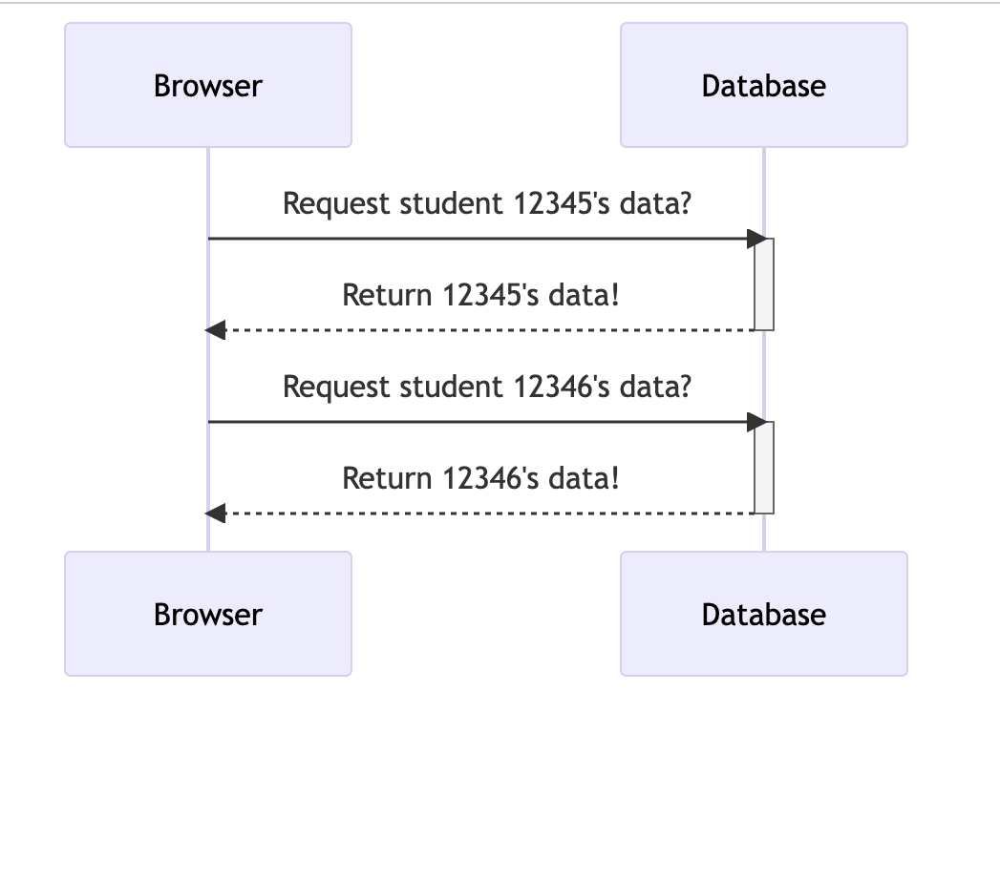

# Introduction to API Security

API is which is short for Application Programming Interface, is an intermediary that allows two or more applications to communicate with each other. If an application e.g Twitter has an API, then external/third party clients can use it to make requests. APIs often provide the capability to create, read and modify sensitive information stored in an organization. If the third parties accessing an API manage to get hold of sensitive information about an application or the people using the app, this may lead to a **data breach**.

API security on the other hand is the process and the measures put in place to protect APIs and the data read, created or updated by these APIs from security attacks. Since the applications expose their APIs to the public, the APIs are at a bigger risk of exploitation of vulnerabilities to gain unauthorized access which compromized the integrity and confidentiality aspect of the data transimitted by your APIs.

## Common API security risks

### Authentication-based attacks

Most APIs require the users to get authenticated before they can sytart making requests. However, there are several ways an attacker could compromise this e.g by social engineering or phishing to obtain the users authentication credentials or even intercepting the token returned when the user logs in. If the API has excessive data returned in the token, then the attacker will be able to access users data.

After a user is authenticated, most application retain some data refred to as session data for subsequent requests authentication which containst information such as a users access rights.

Example:

### Authorization errors

Authorization dictates the level of access a user has. If not carefully managed, a user may end up having access to more data than they need and in the instance that their account gets compromised, the applications has a wider risk.

Example:

### DDOS attacks

An attacker can automate the brute force method they use to try login to your application. Too many requests targeted towards the API may make the API unavailable to authentic users of your API.

Example:

### SQL injection attacks

An SQL injection is atype of attack that is targeted towards applications that use SQL commands to manipulate their databases. SQL injections mostly use known SQL vulnerabilities happens when forms and API requests don't validate user input to reject code as input. If the app doesn't validate user input before the data is added to its database, the SQL queries may be manipulated by the code the attacker puts in to manipulate the users database e.g to add a backdoor to the app or even delete or manipulate records in the DB.

The API requiests are basically querying the database and without proper request valiodation in place, an attacker can manipulate the DB.

### Insecure direct object refences (IDOR)

IDOR is an API vulnerability that results from the end user being able access database objects using their own input. This stems from the lack of proper access rights in an applications. Using IDOR, an attacker can manipulate the direct object reference such as a URL query parameter, database key, session id etc and get access to data or information they shouldn't have acess to. For example, for a student to check their results, they login to their portal. If the URL to check their results is: `https://student-portal/{student-id}`, they can can change their student id to another students id and access their results if proper validation isn't put in place. Even worse is if they are able to use an automation tool to loop through all the student records in the application and access their data.

In this scenario, the student id is the direct object reference. Using IDOR an attacker can access data they aren't authorized to access. This is one case of excessive data exposure in applications.

### Cross-site scripting (XSS) attacks

An XSS attack is one where the attacker injects malicious javascript scripts into a trusted website. An authenticated user to a system may receive a link to the website with some script embedded into it. If the app doesn't do proper data sanitization, the attackers script gets executed on the users browser. The attacker is then able to steal the data e.g cookie, PII etc they want to meet their objective.
