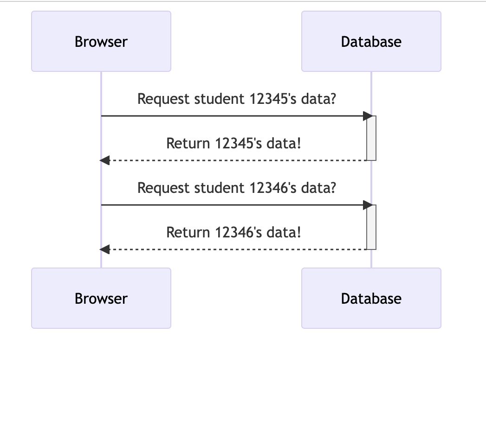

# Common API Security Threats

## Authentication-based attacks

One of the primary ways that APIs maintain security is through authentication, which ensures that only authorized users can access an app's data and functionality. However, attackers may attempt to compromise authentication measures to gain access to sensitive information.

One common method of authentication-based attacks is *social engineering* or *phishing*, where attackers trick users into disclosing their authentication credentials. Attackers may also try to intercept the authentication token that is returned when a user logs in and if the token isn't encrypted, the attacker may be able to access the user's data.

After a user is authenticated, most applications retain session data for subsequent requests, which includes information such as the user's access rights. Attackers can potentially exploit this session data if it is not adequately secured, allowing them to gain access to sensitive information or perform unauthorized actions.

CIA Triad affected: **Confidentiality**, **Integrity**

## Authorization errors

Authorization is a critical aspect of API security, as it determines the level of access that users have to data and functionality. Improper handling of authorization errors can lead to sensitive information disclosure, as error messages may inadvertently reveal implementation details of the application that attackers can exploit. For instance, consider a "icorrect password" error message in a login form. If an attacker is attempting to breach an application and receives this error message, they can infer that the associated email address exists in the system, which can help them in their attack. Therefore, it is crucial to carefully craft authorization error messages to avoid revealing sensitive information to potential attackers.

CIA Triad affected: **Integrity**

## Distributed Denial of Service(DDoS) attacks

A DDos attack happens when attackers attempt to overwhelm an API with a flood of traffic from multiple sources. This can cause the API to become unavailable to legitimate users, leading to system downtime and potentially disrupting business operations.

One common method of DDoS attacks against APIs is through brute force attacks, where attackers use automation to repeatedly try to log in to an API with various username and password combinations. This flood of login attempts can cause the API to become overwhelmed and unresponsive.

CIA Triad affected: **Availability**

## SQL injection attacks

An SQL injection is atype of attack that is targeted towards applications that use SQL commands to manipulate their databases. SQL injections use known SQL vulnerabilities to compromise systems. SQL injections happens when forms and API requests don't validate user input to reject code as input. If the app doesn't validate user input before the data is added to its database, the SQL queries may be manipulated by the code the attacker puts in to manipulate the users database e.g to add a backdoor to the app or even delete or manipulate records in the DB.

CIA Triad affected: **Confidentiality**, **Integrity**

## Insecure direct object refences (IDOR)

IDOR is an API vulnerability that results from the end user being able access database objects using their own input. This stems from the lack of proper access rights in an applications. Using IDOR, an attacker can manipulate the direct object reference such as a URL query parameter, database key, session id etc and get access to data or information they shouldn't have acess to.

For example, for a student to check their results, they login to their portal. If the URL to check their results is: `https://student-portal/{student-id}`, they can can change their student id to another students id and access their results if proper validation isn't put in place. Even worse is if they are able to use an automation tool to loop through all the student records in the application and access their data.

In this scenario, the student id is the direct object reference. Using IDOR an attacker can access data they aren't authorized to access. This is one case of excessive data exposure in applications.

CIA Triad affected: **Confidentiality**, **Integrity**

## Cross-site scripting (XSS) attacks

A website An XSS attack is one where the attacker injects browser-side scripts into a trusted website's webpages. An authenticated user to a system may receive a link to the website with some script embedded into it. If the app doesn't do proper data sanitization, the attackers script gets executed on the users browser. The attacker is then able to steal the data e.g cookie, PII etc they want to meet their objectives.

CIA Triad affected: **Integrity**, **Confidentiality**
